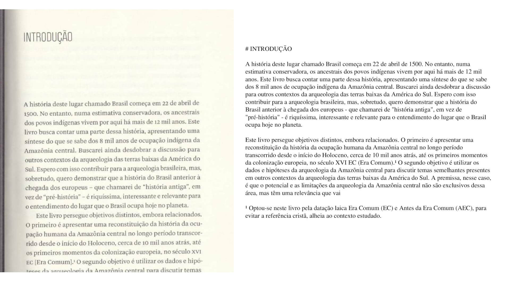

# PDF-OCR CLI Tool

[](https://codecov.io/gh/luandro/pdf-ocr)
[](https://github.com/luandro/pdf-ocr/actions/workflows/npm-publish.yml)
[](https://badge.fury.io/js/pdf-ocr-cli)
[](https://opensource.org/licenses/ISC)

## Overview

A powerful TypeScript CLI tool that transforms scanned PDFs into searchable documents by:

- Taking a PDF file input
- Intelligently detecting and splitting pages that contain two pages side by side
- Detecting page content type (text, image, or empty) and handling each appropriately
- Processing text pages with Mistral API's OCR capabilities
- Preserving original image-only pages and skipping empty pages
- Optionally verifying and improving text quality with Together.ai's free LLM, using previous page context
- Reassembling everything into a searchable PDF

Perfect for digitizing paper documents, making image-based PDFs searchable, and extracting text from scanned materials.

Here are example results:



## Quick Start

### Prerequisites

- Node.js 14 or higher
- Mistral API key ([sign up here](https://mistral.ai))
- Together.ai API key for verification feature ([sign up here](https://together.ai))

### Installation

```bash
# Install globally
npm install -g pdf-ocr-cli

# Or use without installing
npx pdf-ocr-cli --input input.pdf --output output.pdf
```

### Set Up API Keys

Create a `.env` file in your working directory:

```bash
echo "MISTRAL_API_KEY=your_mistral_api_key_here" > .env
echo "TOGETHER_API_KEY=your_together_api_key_here" >> .env
```

Or set environment variables in your shell:

```bash
export MISTRAL_API_KEY=your_mistral_api_key_here
export TOGETHER_API_KEY=your_together_api_key_here
```

### Basic Usage

```bash
# Process a PDF file
pdf-ocr --input input.pdf --output output.pdf

# With verification to improve OCR quality
pdf-ocr --input input.pdf --output output.pdf --verify

# With automatic page split detection for book scans
pdf-ocr --input book-scan.pdf --output book-text.pdf --detect-splits

# With content type detection to handle images and empty pages
pdf-ocr --input mixed-content.pdf --output processed.pdf --detect-content --preserve-images --skip-empty

# With verification and all advanced features enabled
pdf-ocr --input complex-document.pdf --output enhanced.pdf --verify --detect-splits --detect-content --preserve-images --skip-empty
```

## Common Use Cases

### Process Large Documents Efficiently

```bash
# Process 3 pages at a time
pdf-ocr --input input.pdf --output output.pdf --concurrency 3
```

### Handle Network Issues

```bash
# Increase retries and timeout for unstable connections
pdf-ocr --input input.pdf --output output.pdf --retries 5 --timeout 60000
```

### Process Carefully with Detailed Logs

```bash
# Process one page at a time with longer pauses and verbose logging
pdf-ocr --input input.pdf --output output.pdf --concurrency 1 --sleep 10000 --verbose
```

## Command Options

### Basic Options
| Option | Alias | Description | Default |
|--------|-------|-------------|---------|
| `--input` | `-i` | Input PDF file path | *Required* |
| `--output` | `-o` | Output PDF file path | *Required* |
| `--concurrency` | `-c` | Pages to process in parallel | 2 |
| `--max-pages` | `-m` | Maximum pages to process | All |
| `--help` | `-h` | Display help information | |
| `--version` | `-v` | Display version information | |

### OCR Options
| Option | Alias | Description | Default |
|--------|-------|-------------|---------|
| `--retries` | `-r` | Maximum OCR retry attempts | 3 |
| `--retry-delay` | `-d` | Delay between retries (ms) | 1000 |
| `--timeout` | `-t` | OCR API request timeout (ms) | 30000 |
| `--sleep` | `-s` | Time between processing pages (ms) | 5000 |
| `--verbose` | `-v` | Enable detailed logging | |

### Verification and AI Options
| Option | Description | Default |
|--------|-------------|---------|
| `--verify` | Enable LLM verification | |
| `--detect-splits` | Enable automatic page split detection | |
| `--detect-content` | Detect page content type (text, image, empty) | |
| `--preserve-images` | Preserve original image-only pages without OCR | |
| `--skip-empty` | Skip empty pages | |
| `--max-tokens` | Maximum tokens for LLM operations | 1000 |
| `--temperature` | Temperature for LLM operations | 0.7 |
| `--top-p` | Top-p for LLM operations | 0.9 |

## Advanced Installation

### Install from Source

```bash
# Clone and build
git clone https://github.com/luandro/pdf-ocr.git
cd pdf-ocr
npm install
npm run build

# Set up environment
cp .env.example .env
# Edit .env with your API keys
```

## Development

This project follows Test-Driven Development principles:

```bash
# Run tests with coverage
npm test

# Run tests in watch mode
npm run test:watch

# Build the project
npm run build

# Run in development mode
npm run dev -- --input input.pdf --output output.pdf
```

### Test Coverage

The project maintains high test coverage (>80%) for quality assurance:

```bash
# Run tests with coverage
npm test

# View coverage report
open coverage/lcov-report/index.html
```

### Continuous Integration

GitHub Actions automates testing and publishing:
- Tests run on every push to main
- Coverage reports are generated
- Automatic npm publishing when tests pass

## Architecture

The application consists of these key modules:

1. **PDF Splitter** (`src/splitPdf.ts`): Divides PDFs into individual pages
2. **Page Split Detection** (`src/pageSplitDetection.ts`): Detects pages that need splitting
3. **PDF Page Splitter** (`src/splitPdfPage.ts`): Splits pages with two pages side by side
4. **Page Content Detection** (`src/pageContentDetection.ts`): Detects page content type (text, image, empty)
5. **Page Preservation** (`src/preserveOriginalPage.ts`): Preserves original image-only pages
6. **OCR Module** (`src/ocr.ts`): Extracts text using Mistral API
7. **Content Verification** (`src/contentVerification.ts`): Improves text with LLM, using previous page context
8. **Text-to-PDF Converter** (`src/textToPdf.ts`): Converts text back to PDF
9. **PDF Merger** (`src/mergePdfs.ts`): Combines processed pages
10. **CLI** (`src/cli.ts`): Provides the command interface

### Processing Pipeline

1. Split input PDF into individual pages
2. Process each page sequentially:
   - Check if the page contains two pages side by side (if enabled)
   - Split the page into two separate pages if needed
   - Detect page content type (text, image, empty) if enabled
   - Skip empty pages if configured
   - Preserve original image-only pages if configured
   - Extract text with Mistral API OCR for text pages
   - Optionally verify/improve text with Together.ai, using previous page context for better accuracy
   - Convert text back to PDF format
3. Merge all processed pages into final PDF

## Troubleshooting

- **API Key Errors**: Ensure your `.env` file contains valid API keys
- **Network Issues**: Try increasing `--retries`, `--timeout`, and `--retry-delay`
- **Poor OCR Quality**: Enable `--verify` to improve text with LLM (now with previous page context for better accuracy)
- **Book Scans with Two Pages**: Enable `--detect-splits` to automatically split pages
- **Mixed Content Documents**: Enable `--detect-content` with `--preserve-images` and `--skip-empty`
- **Processing Large Files**: Reduce `--concurrency` and increase `--sleep`
- **Memory Issues**: Process fewer pages at once with `--max-pages`

## Contributing

Please see [CONTRIBUTING.md](CONTRIBUTING.md) for guidelines on contributing to this project.

## License

This project is licensed under the ISC License - see the [LICENSE](LICENSE) file for details.
